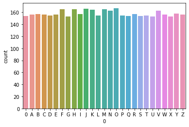
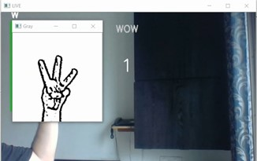

# Sign-To-Speech_conversion
Unable to communicate verbally is a disability. In order to communicate there are many ways, one of the most popular methods is the use of predefined sign languages. The purpose of this project is to bridge the research gap and to contribute to recognize American sign languages(ASL) with maximum efficiency. This repository focuses on the recognition of ASL in real time, converting predicted characters to sentences and output is generated in terms of voice formats. The system is trained by convolutional neural networks for the classification of 26 alphabets and one extra alphabet for null character. The proposed work has achieved an efficiency of 99.88% on the test set.

## Data Distribution
A total of 17113 images have been included in the field of study. 
* There are around 600 images per alphabet. 
* A total of 12845 images were considered for the training set. Out of these, 0.3% of the images were used for validation. 
* A total of 4368 images were used in the testing phase to evaluate the accuracy of the model.
 
 

 
The figure above shows the training data distribution. 
 
The figure above shows the testing data distribution. 

The dataset used in this field of study can be downloaded from: 
https://drive.google.com/drive/folders/16ce6Hc4U5Qr6YBArcozoYom6TT5-7oSc?usp=sharing

## Data-Preprocessing
The images from the dataset were pre-processed by eliminating the background noise. Several crucial preprocessing steps are listed below:
* Gaussian Blur: Gaussian filter is used to blur the given image, reduce noise and smoothen the images. 
* Grayscale Conversion: A grayscale image has equal intensities in RGB space. It becomes easier to differentiate such images from any other sort of colour image as the number of color channels are reduced.
* Canny Edge Detector:  A multistage algorithm used to detect a wide range of edges in images. 
* Normalization: Input stream of pixel values(0-255) in the data is converted to a scale of 0 to 1 by broadcasting a division by 255. It makes the system to better understand and gives almost an equal importance to each of the pixel values. 

## Feature Extraction
* A Gaussian filter is applied to make the image smooth and  remove the noise.
* Intensity gradients of the image are calculated.
* Non-maximum suppression is applied to remove the possibility of a false response. 
* Double thresholding is done to detect or determine the possible edges. 
* Edges are finalized by identifying and removing all other edges that are weak and not linked to strong edges. 
  
The above figure shows pre-processed image with extracted features which is sent to the model for classification.
## Proposed Flow

 
The figure above shows a detailed pipeline of the model architecture. It can be interpreted that a Convolutional architecture has been proposed.

## SETUP
* Fork the repository at your profile
* Git Clone the repository to your local machine. 
* pip install - r requirements.txt
* Download the dataset from the mentioned [LINK](https://drive.google.com/drive/folders/16ce6Hc4U5Qr6YBArcozoYom6TT5-7oSc?usp=sharing).
* Load the Dataset and the Training file from [Train_File](https://github.com/beingaryan/Automated-Sign-To-Speech-Conversion/blob/master/ASL_train.ipynb).
* Predict Real-Time Sentences using [Real-Time](https://github.com/beingaryan/Automated-Sign-To-Speech-Conversion/blob/master/ASL_Real-Time.ipynb) file.
* NOTE: You can directly use [asl_classifier.h5](https://github.com/beingaryan/Automated-Sign-To-Speech-Conversion/blob/master/asl_classifier.h5) file trained by me for real-time predictions in [Real-Time](https://github.com/beingaryan/Automated-Sign-To-Speech-Conversion/blob/master/ASL_Real-Time.ipynb) file.

## Results and Analysis
* The model has been trained on a python based environment on Jupyter platform for 20 epochs. 
* The model has achieved an accuracy of 97.45 % on Training Set with 99.88 % accuracy on the Validation set.
* The prescribed model has been evaluated on Test set where it has attained an accuracy of 99.85% with loss of 0.60 %.
 
* The above figure shows the Loss plot of the model throughout it's training journey. 
* It can be interpreted that the loss decreases with increasing epochs.
   
* The above figure shows the Accuracy plot of the model throughout it's training journey. 
* It can be interpreted that the accuracy incraeses with increasing epochs for both train and val sets.
   
* The training phase data has been evaluated on the Heatmap Plotting representation. 
 
* The prescribed inference suggests that the trained classes are highly correlated with the same class of the data. 

* The model has been evaluated for Precision, Recall, F1-score metrics for all the 26 classes along with a null class. 
   
* The analysis carried has been shown in the classification report attached above. 
* It can be interpreted that the average weighted F1-score metrics is 1 which describes effective learning and low false predictions.

## Output Snapshots
 
The above figure shows correctly classified word: "WOW"  
 
The above figure shows correctly classified word: "I SEE IT" 
 
The above figure shows correctly classified word: "HI HOW ARE YOU" 
 
## References
The above work is inspired by several recent researches in the field of Deep Learning. Some notable shoutout goes to: 
* K. Manikandan, Ayush Patidar, Pallav Walia, Aneek Barman Roy.(2017). Hand Gesture Detection and Conversion to Speech and Text. ARXIV
* Omkar Vedak, Prasad Zavre, Abhijeet Todkar, Manoj Patil.(2019). INTERNATIONAL RESEARCH JOURNAL OF ENGINEERING AND TECHNOLOGY (IRJET).Sign Language Interpreter using Image Processing and Machine Learning
* Pramada, Sawant & Vaidya, Archana. (2013). Intelligent Sign Language Recognition Using Image Processing. IOSR Journal of Engineering. 03. 45-51. 10.9790/3021-03224551.

## Doubt Support
For further queries, you can reach out to me via:
* [Linkedin](https://www.linkedin.com/in/aryan-gupta-6a9201191/) handle
* [Instagram](https://www.instagram.com/beingryaan/)
* Email-Id: aryan.gupta18@vit.edu

## Contribution Norms
* Feel free to come up with updates and modifications in the project.
* Pull requests are welcomed.

